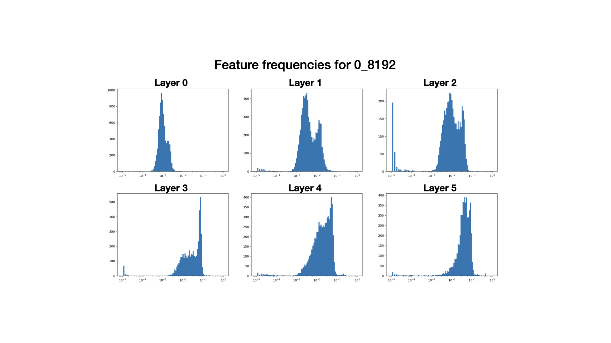
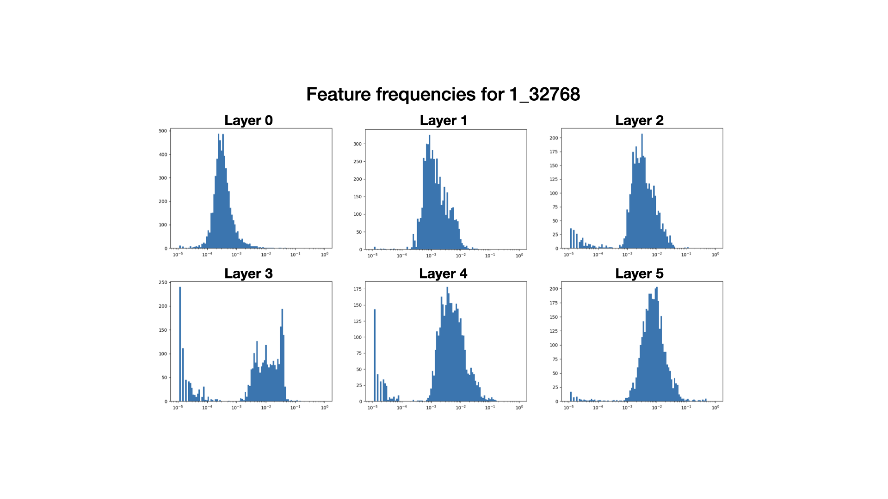

This is a repository for doing dictionary learning via sparse autoencoders on neural network activations. It was developed by Samuel Marks and Aaron Mueller. 

For accessing, saving, and intervening on NN activations, we use the [`nnsight`](http://nnsight.net/) package; as of December 2023, nnsight is under active development and may undergo breaking changes. That said, `nnsight` is easy to use and quick to learn; if you plan to modify this repo, then we recommend going through the main `nnsight` demo [here](http://nnsight.net/tutorials/main_demo/).

Some dictionaries trained using this repository (and asociated training checkpoints) can be accessed at [https://baulab.us/u/smarks/autoencoders/](https://baulab.us/u/smarks/autoencoders/). See below for more information about these dictionaries.

# Set-up

Navigate to the to the location where you would like to clone this repo, clone and enter the repo, and install the requirements.
```bash
git clone git@github.com:saprmarks/dictionary_learning.git
cd dictionary_learning
pip install -r requirements.txt
```

To use `dictionary_learning`, include it as a subdirectory in some project's directory and import it; see the examples below.

# Using trained dictionaries

To use a dictionary, just import the dictionary class (currently only autoencoders are supported), initialize an `AutoEncoder`, and load a saved state_dict.
```python
from dictionary_learning.dictionary import AutoEncoder
import torch

activation_dim = 512 # dimension of the NN's activations to be autoencoded
dictionary_size = 16 * activation_dim # number of features in the dictionary
ae = AutoEncoder(activation_dim, dictionary_size)
ae.load_state_dict(torch.load("path/to/dictionary/weights"))

# get NN activations using your preferred method: hooks, transformer_lens, nnsight, etc. ...
# for now we'll just use random activations
activations = torch.randn(64, activation_dim)
features = ae.encode(activations) # get features from activations
reconstructed_activations = ae.decode(features)
```

Dictionaries have `encode`, `decode`, and `forward` methods -- see `dictionary.py`.

# Training your own dictionaries

To train your own dictionaries, you'll need to understand a bit about our infrastructure.

One key object is the `ActivationBuffer`, defined in `buffer.py`. Following [Neel Nanda's appraoch](https://www.lesswrong.com/posts/fKuugaxt2XLTkASkk/open-source-replication-and-commentary-on-anthropic-s), `ActivationBuffer`s maintain a buffer of NN activations, which it outputs in batches.

An `ActivationBuffer` is initialized from an `nnsight` `LanguageModel` object, a submodule (e.g. an MLP), and a generator which yields strings (the text data). It processes a large number of strings, up to some capacity, and saves the submodule's activations on your CPU. You sample batches from it, and when it is half-depleted, it refreshes itself with new text data.

Here's an example for training a dictionary; in it we load a language model as an `nnsight` `LanguageModel` (this will work for any Huggingface model), specify a submodule, create an `ActivationBuffer`, and then train an autoencoder with `trainSAE`.
```python
from nnsight import LanguageModel
from dictionary_learning.buffer import ActivationBuffer
from dictionary_learning.training import trainSAE

model = LanguageModel(
    'EleutherAI/pythia-70m-deduped', # this can be any Huggingface model
    device_map = 'cuda:0'
)
submodule = model.gpt_neox.layers[1].mlp # layer 1 MLP
activation_dim = 512 # output dimension of the MLP
dictionary_size = 16 * activation_dim

# data much be an iterator that outputs strings
data = iter([
    'This is some example data',
    'In real life, for training a dictionary',
    'you would need much more data than this'
])
buffer = ActivationBuffer(
    data,
    model,
    submodule,
    out_feats=activation_dim, # output dimension of the model component
) # buffer will return batches of tensors of dimension = submodule's output dimension

# train the sparse autoencoder (SAE)
ae = trainSAE(
    buffer,
    activation_dim,
    dictionary_size,
    lr=3e-4,
    sparsity_penalty=1e-3,
    device='cuda:0'
)
```

Aside from the use of the `ActivationBuffer`, we train our SAEs as specified in [Anthropic's paper](https://transformer-circuits.pub/2023/monosemantic-features/index.html). This includes:
* Using untied encoder/decoder weights
* Constraining decoder vectors to have unit norm.
* Resampling dead neurons according to the procedure specified [here](https://transformer-circuits.pub/2023/monosemantic-features/index.html#appendix-autoencoder-resampling).

In addition, we have a brief learning-rate linear warm-up at the beginning of training; this is to fix a problem that we noticed when using the Adam optimizer, namely that many neurons were killed in the first few gradient steps. (There was no such problem when using SGD.)

If you are working with a model/model component where the activations are tuples `(hidden_state, other_stuff)`, you'll need to modify the code slightly, changing `.value` into `.value[0]` in a number of places. For example, this is the case if you would like to train a dictionary on the residual stream of a Pythia model.

# Downloading our open-source dictionaries

To download our open-source dictionaries and associated training checkpoints, navigate to the directory you would like to save the dictionaries in, and then:
```bash
wget -r --noparent https://baulab.us/u/smarks/autoencoders/
```

Currently, we've made available two sets of dictionaries for EleutherAI's pythia-70m-deduped. Both were both trained on 512-dimensional MLP *output* activations (not the hidden layer), using ~800M tokens from [The Pile](https://pile.eleuther.ai/). 
* The first set, called `0_8192`, consists of dictionaries of size 8192 = 16 * 512. These were trained with an l1 penalty of `1e-3`. 
* The second set, called `1_32768`, consists of dictionaries of size 32768 = 64 * 512. These were trained with an l1 penalty of `3e-3`.

Let's explain the directory structure by example. The `autoencoders/pythia-70m-deduped/mlp_out_layer1/0_8192` directory corresponds to the layer 1 MLP dictionary from the first set. This directory contains:
* `ae.pt`: the `state_dict` of the fully trained dictionary
* `config.json`: a json file which specifies the hyperparameters used to train the dictionary
* `checkpoints/`: a directory containing training checkpoints of the form `ae_step.pt`.

## Statistics for our dictionaries

We'll report the following statistics:
* **MSE loss**: average squared L2 distance between an activation and the autoencoder's reconstruction of it
* **L1 loss**: a measure of the autoencoder's sparsity
* **L0**: average number of features active above a random token
* **Percentage of neurons alive**: fraction of the dictionary features which are active on at least one token out of 8192 random tokens
* **Percentage of loss recovered**: when replacing the MLP's output with the dictionary's reconstruction of the output, the percentage of the model's cross-entropy loss on token prediction is recovered (relative to the baseline of zero ablating the MLP's output)

For dictionaries in the `0_8192` set:
| Layer | MSE Loss | L1 loss | L0 | % Alive | % Loss Recovered |
|-------|----------|---------|----|---------|------------------|
| 0 | 0.056 | 6.132 | 9.951 | 0.998 | 0.984 |
| 1 | 0.089 | 6.677 | 44.739 | 0.887 | 0.924 |
| 2 | 0.108 | 11.44 | 62.156 | 0.587 | 0.867 |
| 3 | 0.135 | 23.773 | 175.303 | 0.588 | 0.902 |
| 4 | 0.148 | 27.084 | 174.07 | 0.806 | 0.927 |
| 5 | 0.179 | 47.126 | 235.05 | 0.672 | 0.972 |

For dictionaries in the `1_32768` set:
| Layer | MSE Loss | L1 loss | L0 | % Alive | % Loss Recovered |
|-------|----------|---------|----|---------|------------------|
| 0 | 0.09 | 4.32 | 2.873 | 0.174 | 0.946 |
| 1 | 0.13 | 2.798 | 11.256 | 0.159 | 0.768 |
| 2 | 0.152 | 6.151 | 16.381 | 0.118 | 0.724 |
| 3 | 0.211 | 11.571 | 39.863 | 0.226 | 0.765 |
| 4 | 0.222 | 13.665 | 29.235 | 0.19 | 0.816 |
| 5 | 0.265 | 26.4 | 43.846 | 0.13 | 0.931 |

Here also are histograms of feature frequencies over a batch of 16384 random tokens.





Some observations:
* The l1 penalty for the `1_32768` seems to have been too large; only 10-20% of the neurons are alive, and the loss recovered is much worse. That said, we'll remark that after examining features from both sets of dictionaries, the dictionaries from the `1_32768` set seem to have more interpretable features than those from the `0_8192` set (though it's hard to tell).
    * In particular, we suspect that for `0_8192`, the many high-frequency features in the later layers are uninterpretable but help significantly with reconstructing activations, **resulting in deceptively good-looking statistics**. (See the bullet point below regarding neuron resampling and bimodality.)
* As we progress through the layers, the dictionaries tend to get worse along most metrics (except for % loss recovered). This may have to do with the growing scale of the activations themselves as one moves through the layers of pythia models (h/t to Arthur Conmy for raising this hypothesis).

Some miscellaneous details for those who want to train dictionaries:
* We note that our dictionary features are significantly higher frequency than the features in [Anthropic's](https://transformer-circuits.pub/2023/monosemantic-features/index.html) and [Neel Nanda's](https://www.lesswrong.com/posts/fKuugaxt2XLTkASkk/open-source-replication-and-commentary-on-anthropic-s). We don't know if this difference is because we are working with a multi-layer model or if it is because of a difference in hyperparameters. We generally suspect it would be better if we were learning features of lower frequency.
    * We'll note, however, that after layer 0, it doesn't seem like many of our features are of the form "always fire on a particular token," whereas many of Anthropic's feature were. So it's possible that more interesting features also tend to be higher-frequency. See [here](https://www.lesswrong.com/posts/tEPHGZAb63dfq2v8n/?commentId=zXEsbbJHsg98FY6uj) for some flavor.
* Even though the number of steps in `config.json` for `1_32768` is twice that for `0_8192`, the former dictionaries were only trained on for about 3000 more steps (so basically about the same amount).
* We're not sure, but the bimodality in the histograms for `0_8192` may be due to dead neurons being resampled. We resample every 30000 steps, including at step 90000 out of 100000 total steps. The resampled features tend to be very high-frequency, and it might take more than 10000 steps for the peak to move to the left.
* We used `out_batch_size=8192` for our `ActivationBuffer`s and tried to set `n_ctxs` large enough that there wasn't likely to be too many tokens taken from the same context.

# Extra functionality supported by this repo

We've included support for some experimental features. We briefly investigated them as an alternative approaches to training dictionaries.

* **MLP stretchers.** Based on the perspective that one may be able to identify features with "[neurons in a sufficiently large model](https://transformer-circuits.pub/2022/toy_model/index.html)," we experimented with training "autoencoders" to, given as input an MLP *input* activation $x$, output not $x$ but $MLP(x)$ (the same output as the MLP). For instance, given an MLP which maps a 512-dimensional input $x$ to a 1024-dimensional hidden state $h$ and then a 512-dimensional output $y$, we train a dictionary $A$ with hidden dimension 16384 = 16 x 1024 so that $A(x)$ is close to $y$ (and, as usual, so that the hidden state of the dictionary is sparse).
    * The resulting dictionaries seemed decent, but we decided not to pursue the idea further.
    * To use this functionality, set the `io` parameter of an activaiton buffer to `'in_to_out'` (default is `'out'`).
    * h/t to Max Li for this suggestion.
* **Replacing L1 loss with entropy**. Based on the ideas in this [post](https://transformer-circuits.pub/2023/may-update/index.html#simple-factorization), we experimented with using entropy to regularize a dictionary's hidden state instead of L1 loss. This seemed to cause the features to split into dead features (which never fired) and very high-frequency features which fired on nearly every input, which was not the desired behavior. But plausibly there is a way to make this work better.


